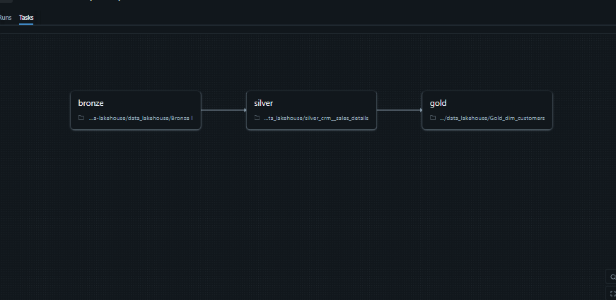

# Bike-data-lakehouse
End-to-end Data Lakehouse built on Databricks using Medallion Architecture (Bronze, Silver, Gold) with automated pipelines and analytics-ready data models.
The pipeline processes a dataset of 10k records

# Databricks Sales Analytics Project

## 📌 Overview
This project implements an end-to-end data engineering pipeline using the Medallion Architecture (Bronze, Silver, Gold) in Databricks.

Raw CRM sales data is ingested, cleaned, transformed, and modeled into analytical tables to support business reporting and dashboards.

---

## 🏗 Architecture
- **Bronze Layer:** Raw ingestion from source systems
- **Silver Layer:** Data cleansing, normalization, and validation
- **Gold Layer:** Star schema with fact and dimension tables

---

## 🧩 Data Model
- `dim_customers`
- `dim_products`
- `fact_sales`

---

## 📊 Dashboards (Databricks SQL)
- Monthly Sales Trend
- Total sales by product
- Active & inactive products
- Sales by gender

Dashboards are built using Gold layer tables.

## 🔁 Data Pipeline Overview

This project follows a Medallion Architecture (Bronze → Silver → Gold).

- **Bronze**: Raw ingestion from source CSV files
- **Silver**: Data cleaning, standardization, validation using SQL
- **Gold**: Business-ready fact and dimension tables for analytics

---

## 🛠 Technologies Used
- Databricks
- Spark SQL
- Delta Lake
- GitHub

---

## ✅ Key Learnings
- Medallion architecture implementation
- Data cleansing and validation
- Dimensional modeling
- Analytical SQL
- Dashboard creation in Databricks SQL
